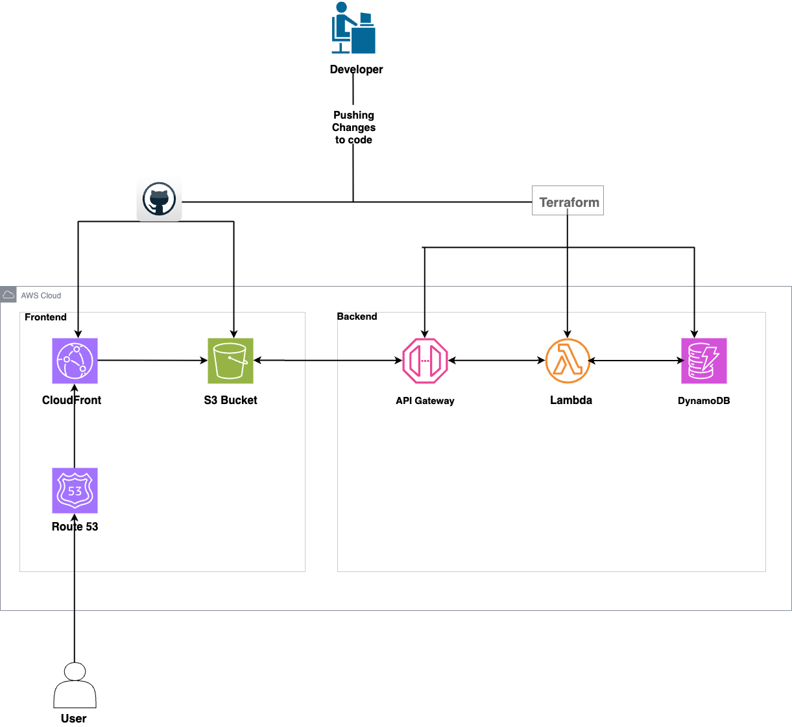

# AWS Cloud Resume Challenge

This project is part of the [Cloud Resume Challenge](https://cloudresumechallenge.dev/)—a hands-on initiative created by Forrest Brazeal to help cloud learners turn theory into a practical, real-world project.

## What I Built

I built and deployed a resume website on AWS that includes a **live visitor counter** powered by serverless technologies.

### Features
- Static resume website using **HTML**, **CSS**, and **JavaScript**
- Hosted on **Amazon S3** with **CloudFront** for global distribution & HTTPS
- Custom domain: [monilshah.cloud](https://monilshah.cloud) via GoDaddy, DNS managed by **Route 53**
- **Visitor counter** displayed using JavaScript & backed by:
  - **AWS Lambda** (Python)
  - **Amazon DynamoDB** (NoSQL storage)
  - **Terraform** for backend IaC (Lambda, DynamoDB, and IAM)
- **GitHub Actions** for CI/CD to automate website deployment to S3

## Tech Stack
- **Frontend**: HTML, CSS, JavaScript
- **Backend**: AWS Lambda, DynamoDB, Python
- **DevOps**: Terraform, GitHub Actions
- **Cloud Services**: S3, CloudFront, Route 53, IAM

## What I Learned
- How to connect multiple AWS services together into a complete working system
- Writing Infrastructure as Code using **Terraform**
- Debugging issues like S3 permissions, CORS errors, and CI/CD failures
- Using AWS documentation and community resources to troubleshoot real-world problems

## Live Site
Check it out here: [monilshah.cloud](https://monilshah.cloud)

## Architecture

